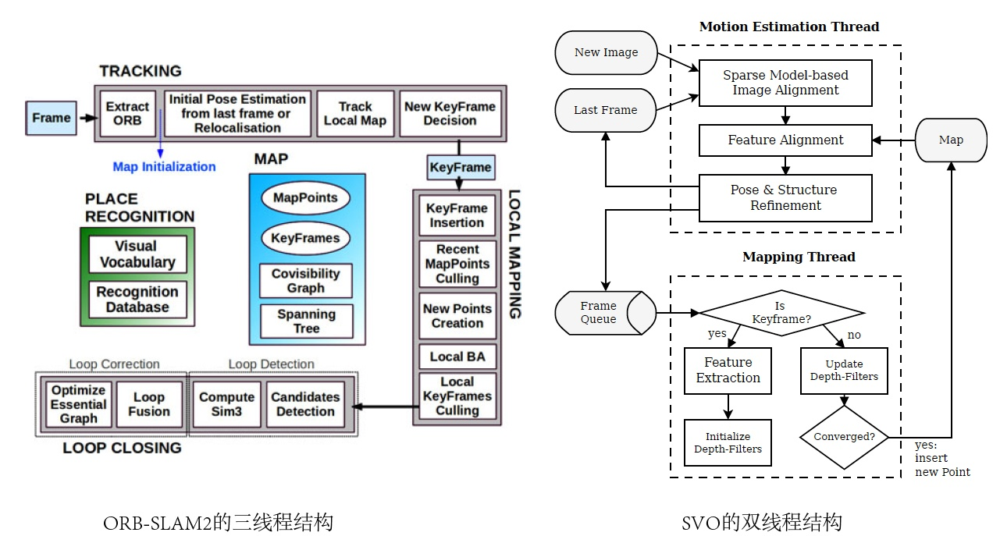
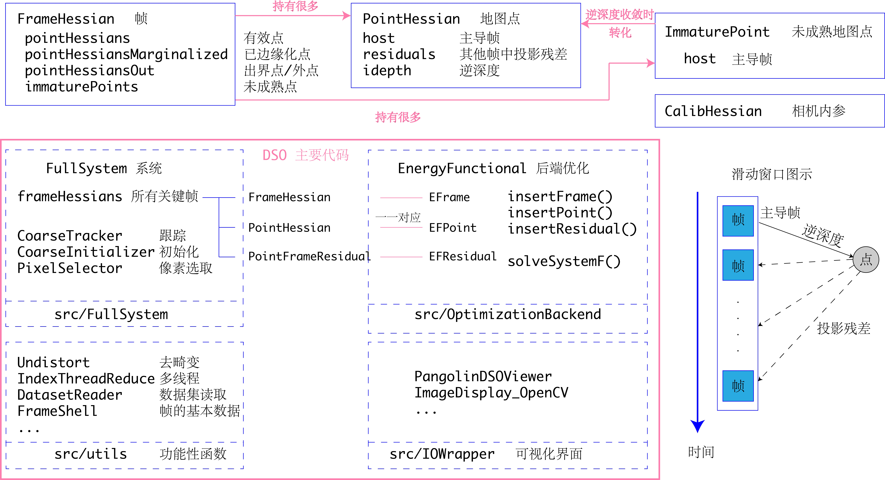
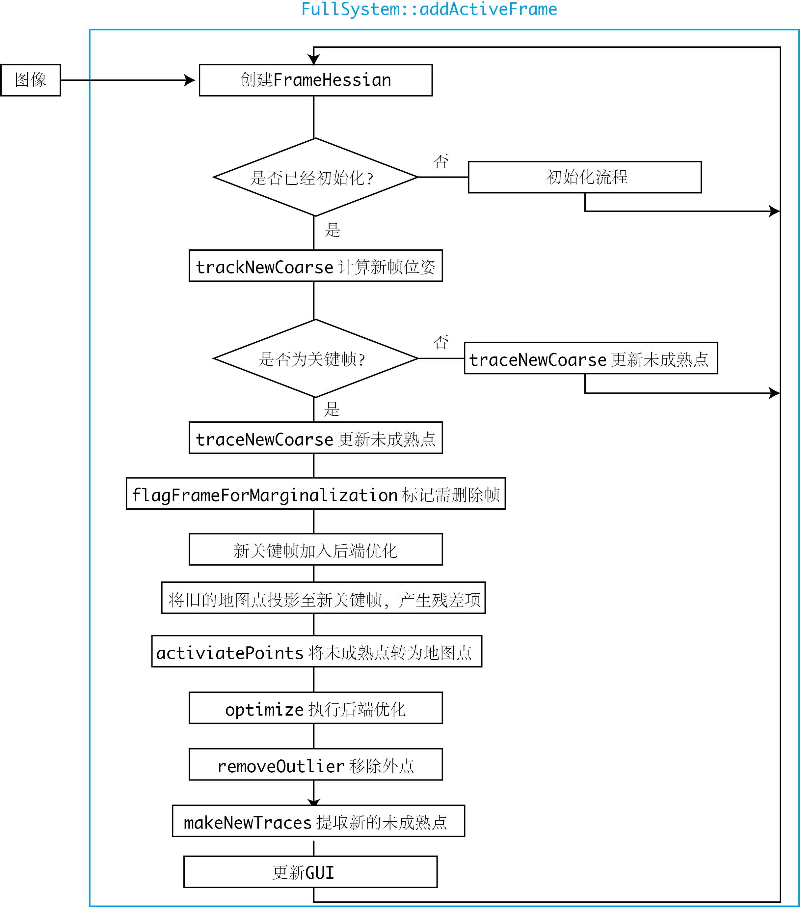
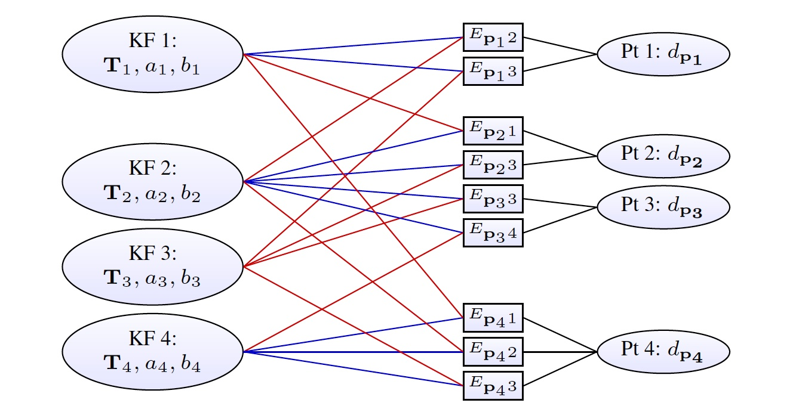

# DSO算法理论解析

##### 本文整理自知乎@半闲居士《DSO详解》

>原文链接：[https://zhuanlan.zhihu.com/p/29177540](https://zhuanlan.zhihu.com/p/29177540)

### 简介

DSO（Direct Sparse Odometry），是慕尼黑工业大学（Technical University of Munich, TUM）计算机视觉实验室的雅各布.恩格尔（Jakob Engel）博士，于2016年发布的一个视觉里程计方法（期刊论文见[1]，实验室主页见Computer Vision Group）。在SLAM领域，DSO属于稀疏直接法，据论文称能达到传统特征点法的五倍速度（需要降低图像分辨率），并保持同等或更高精度，代码见：JakobEngel/dso。然而，由于某些历史和个人的原因，DSO的代码清晰度和可读性，明显弱于其他SLAM方案如ORB、SVO、okvis等，使得研究人员很难以它为基础，展开后续的研究工作。因此，本文希望从理论和实现层面解读DSO，尝试为其他对DSO感兴趣的研究人员提供一些有益的思路和观点。

### 概述

DSO属于稀疏直接法的视觉里程计。它不是完整的SLAM，因为它不包含回环检测、地图复用的功能。因此，它不可避免地会出现累计误差，尽管很小，但不能消除。DSO目前开源了单目实现，双目DSO的论文已被ICCV接收，但目前未知是否开源。

DSO是少数使用纯直接法（Fully direct）计算视觉里程计的系统之一。相比之下，SVO[2]属于半直接法，仅在前端的Sparse model-based Image Alignment部分使用了直接法，之后的位姿估计、bundle adjustment，则仍旧使用传统的最小化重投影误差的方式。而ORB-SLAM2[3]，则属于纯特征法，计算结果完全依赖特征匹配。从方法上来说，DSO是新颖、独树一帜的。

直接法相比于特征点法，有两个非常不同的地方：

- 特征点法通过最小化重投影误差来计算相机位姿与地图点的位置，而直接法则最小化光度误差（photometric error）。所谓光度误差是说，最小化的目标函数，通常由图像之间的误差来决定，而非重投影之后的几何误差。
- 直接法将数据关联（data association）与位姿估计（pose estimation）放在了一个统一的非线性优化问题中，而特征点法则分步求解，即，先通过匹配特征点求出数据之间关联，再根据关联来估计位姿。这两步通常是独立的，在第二步中，可以通过重投影误差来判断数据关联中的外点，也可以用于修正匹配结果（例如[4]中提到的类EM的方法）。

由于这个原因，DSO会一直求解一个比较复杂的优化问题，我们很难将它划分为像特征点法那样一步一步的过程。DSO甚至没有“匹配点”这个概念。每一个三维点，从某个主导帧（host frame）出发，乘上深度值之后投影至另一个目标帧（target frame），从而建立一个投影残差（residual）。只要残差在合理范围内，就可以认为这些点是由同一个点投影的。从数据关联角度看，在这个过程中并没有a1-b1, a2-b2这样的关系，也可能存在a1-b1, a2-b1, a3-b1这样的情况。但是DSO并不在意这些，只要残差不大，我们就看成是同一个点。这是很重要的一点。在特征点法中，我们可以找到一个地图点分别在哪些帧中被看到，乃至找到各帧中的图像描述子是什么；但在DSO中，我们会尝试把每个点投影到所有帧中，计算它在各帧中的残差，而并不在意点和点之间的一一对应关系。

从后端来看，DSO使用一个由若干个关键帧组成的滑动窗口作为它的后端。这个窗口在整个VO过程中一直存在，并有一套方法来管理新数据的加入以及老数据的去除。具体来说，这个窗口通常保持5到7个关键帧。前端追踪部分，会通过一定的条件，来判断新来的帧是否可作为新的关键帧插入后端。同时，如果后端发现关键帧数已经大于窗口大小，也会通过特定的方法，选择其中一个帧进行去除。请注意被去除的帧并不一定是时间线上最旧的那个帧，而是会有一些复杂条件的。

后端除了维护这个窗口中的关键帧与地图点外，还会维护与优化相关的结构。特别地，这里指Gauss-Newton或Levenburg-Marquardt方法中的Hessian矩阵和b向量（仅先验部分）。当我们增加新的关键帧时，就必须扩展H和b的维度；反之，如果需要去掉某个关键帧（以及它携带的地图点）时，也需要降低H和b的维度。这个过程还需要将被删掉帧和点的信息，转移到窗口内剩余帧当中，这一步被称为边缘化（Marginalization）。

由于直接法需要比较图像信息，其结果容易受光照干扰。于是，DSO提出了光度标定，认为对相机的曝光时间、暗角、伽马响应等参数进行标定后，能够让直接法更加鲁棒。对于未进行光度标定的相机，DSO也会在优化中动态估计光度参数（具体来说，是一个仿射变化的参数，记作a和b）。这个过程建模了相机的成像过程，因此对于由相机曝光不同引起的图像明暗变化，会有更好的表现。但是，如果由于环境光源发生变化，光度标定也是无能为力的。

本文第2节介绍DSO基本框架和流程。第3节介绍滑动窗口内的最小二乘问题、雅可比、边缘化。第4节介绍光度标定。第5节会给出我个人对DSO的一些评述。最后列出参考文献。DSO相关的实验、比较结果，请参见作者原始论文，在此不作叙述。

### 框架流程

#### 代码框架与数据表示

现在我们来看DSO的大体框架。我去除了一些不重要的类和结构，方便读者阅读。

DSO整体代码由四个部分组成：系统与各算法集成于src/FullSystem，后端优化位于src/OptimizationBackend，这二者组成了DSO大部分核心内容。src/utils和src/IOWrapper为一些去畸变、数据集读写和可视化UI代码。先来看核心部分的FullSystem和OptimizationBackend。

如上图上半部分所示，在FullSystem里，DSO致力于维护一个滑动窗口内部的关键帧序列。每个帧的数据存储于FrameHessian结构体中，FrameHessian即是一个带着状态变量与Hessian信息的帧。然后，每个帧亦携带一些地图点的信息，包括：

- pointHessians是所有活跃点的信息。所谓活跃点，是指它们在相机的视野中，其残差项仍在参与优化部分的计算；
- pointHessiansMarginalized是已经边缘化的地图点。
- pointHessiansOut是被判为外点（outlier）的地图点。
- 以及immaturePoints为未成熟地图点的信息

在单目SLAM中，所有地图点在一开始被观测到时，都只有一个2D的像素坐标，其深度是未知的。这种点在DSO中称为未成熟的地图点：Immature Points。随着相机的运动，DSO会在每张图像上追踪这些未成熟的地图点，这个过程称为trace——实际上是一个沿着极线搜索的过程，十分类似于svo的depth filter。Trace的过程会确定每个Immature Point的逆深度和它的变化范围。如果Immature Point的深度（实际中为深度的倒数，即逆深度）在这个过程中收敛，那么我们就可以确定这个未成熟地图点的三维坐标，形成了一个正常的地图点。具有三维坐标的地图点，在DSO中称为PointHessian。与FrameHessian相对，PointHessian亦记录了这个点的三维坐标，以及Hessian信息。

与很多其他SLAM方案不同，DSO使用单个参数描述一个地图点，即它的逆深度。而ORB-SLAM等多数方案，则会记录地图点的x,y,z三个坐标。逆深度参数化形式具有形式简单、类似高斯分布、对远处场景更为鲁棒等优点[5]，但基于逆深度参数化的Bundle adjustment，每个残差项需要比通常的BA多计算一个雅可比矩阵。为了使用逆深度，每个PointHessian必须拥有一个主导帧（host frame），说明这个点是由该帧反投影得到的。

于是，滑动窗口的所有信息，可以由若干个FrameHessian，加上每个帧带有的PointHessian来描述。所有的PointHessian又可以在除主导帧外的任意一帧中进行投影，形成一个残差项，记录于PointHessian::residuals中。所有的残差加起来，就构成了DSO需要求解的优化问题。当然，由于运动、遮挡的原因，并非每个点都可以成功地投影到其余任意一帧中去，于是我们还需要设置每个点的状态：有效的/被边缘化的/无效的。不同状态的点，被存储于它主导帧的pointHessians/pointHessianMarginalized/PointHessiansOut三个容器内。

除此之外，DSO将相机的内参、曝光参数等信息，亦作为优化变量考虑在内。相机内参由针孔相机参数fx, fy, cx, cy表达，曝光参数则由两个参数a,b描述。这部分内容在光度标定一节内。

后端优化部分单独具有独立的Frame, Point, Residual结构。由于DSO的优化目标是最小化能量（energy，和误差类似），所以有关后端的类均以EF开头，且与FullSystem中存储的实例一一对应，互相持有对方的指针。优化部分由EnergyFunctional类统一管理。它从FullSystem中获取所有帧和点的数据，进行优化后，再将优化结果返回。它也包含整个滑动窗口内的所有帧和点信息，负责处理实际的非线性优化矩阵运算。

#### VO流程

每当新的图像到来时，DSO将处理此图像的信息，流程如下：

尽管没有解释每一步的具体用意，但可以看出DSO的大致流程。从上图可以简单总结出DSO的行为：

- 对于非关键帧，DSO仅计算它的位姿，并用该帧图像更新每个未成熟点的深度估计；
- 后端仅处理关键帧部分的优化。除去一些内存维护操作，对每个关键帧主要做的处理有：增加新的残差项、去除错误的残差项、提取新未成熟点。
- 整个流程在一个线程内，但内部可能有多线程的操作。

### DSO详细介绍

#### 残差的构成与雅可比

在VO过程中，DSO会维护一个滑动窗口，通常由5-7个关键帧组成，流程如前所述。DSO试图将每个先前关键帧中的地图点投影到新关键帧中，形成残差项。同时，会在新关键帧中提取未成熟点，并希望它们演变成正常地图点。在实际当中，由于运动、遮挡的原因，部分残差项会被当作outlier，最终剔除；也有部分未成熟地图点无法演化成正常地图点，最终被剔除。

滑动窗口内部构成了一个非线性最小二乘问题。表示成因子图（或图优化）的形式，如下所示：

每一个关键帧的状态为八维：六自由度的运动位姿加上两个描述光度的参数；每个地图点的状态变量为一维，即该点在主导帧（Host）里的逆深度。于是，每个残差项（或能量项E），将关联两个关键帧与一个逆深度。事实上，还有一个全局的相机内参数亦参与了优化，但未在此图中表示。

现在我们来考虑如何计算残差。这部分推导和LSD-SLAM的会议论文[6]，以及我的书[7]是类似的。如果读者觉得有困难，可以参照它们。

设相机模型由针孔模型描述，那么内参矩阵为：

TODO

[公式推导原文链接](https://zhuanlan.zhihu.com/p/29177540)

### 评述

DSO的出现将直接法推进到一个相当成熟可用的地位，许多实验已表明它的精度与鲁棒性均优于现在的ORB-SLAM2，而相比之下LSD-SLAM则显然没有那么成熟。在我自己的实物相机实验中，我发现LSD-SLAM很难一次上手即通，而DSO则鲁棒的多。

在大部分数据集上，DSO均有较好的表现。虽然DSO要求全局曝光相机，但即使是卷帘快门的相机，只要运动不快，模糊不明显，DSO也能顺利工作。但是，如果出现明显的模糊、失真，DSO也会丢失。

我认为，直接法相比传统特征点法，最大的贡献在于，直接法以更整体、更优雅的方式处理了数据关联问题。特征点法需要依赖重复性较强的特征提取器，以及正确的特征匹配，才能得正确地计算相机运动。在环境纹理较好，角点较多时，这当然是可行的——不过直接法在这种环境下也能正常工作。然而，如果环境中出现了下列情况，对特征点法就不那么友善：

- 环境中存在许多重复纹理；
- 环境中缺乏角点，出现许多边缘或光线变量不明显区域；
这在实际图像中很常见，我们以道路环境为例（取自kitti）：

显然，路面上角点甚少，仅有车道线的起始/终止处存在角点，其他地方纹理不足；天空通常也没有纹理；路旁栏杆和障碍物重复纹理非常明显。这些都是特征点法必须面对的问题，所以特征点法通常只能依赖一些车辆、行人、交通告示板来确定明显的特征匹配，这会影响整个SLAM系统的稳定性。其根本原因在于：无法找到有用的匹配点、或者容易找到错误的匹配点。例如，车道线边缘上的点外观都非常相似，栏杆附近的点则由于栏杆本身纹理重复，容易出现错配。

而直接法，如前所示，则并不要求一一对应的匹配。只要先前的点在当前图像当中具有合理的投影残差，我们就认为这次投影是成功的。而成功与否，主要取决于我们对地图点深度以及相机位姿的判断，并不在于图像局部看起来是什么样子。举个例子，如果用特征法或光流法追踪某个位于边缘的像素，由于沿着边缘方向图像局部很相似，所以这个匹配或追踪的结果，可能被计算成此边缘方向的另一个点——这主要是因为图像局部的相似性；而直接法的约束则来自更为整体的相机位姿，所以即使单个点无法给出足够的信息，还可以靠其他点来修正它的投影关系，从而找到正确的投影点。

这是一把双刃剑。直接法给予我们追踪边缘、平滑区块的能力，但同时也要付出代价——正确的直接法追踪需要有一个相当不错的初始估计，还需要一个质量较好的图像。由于DSO严重依赖于使用梯度下降的优化问题求解，而它成功的前提，是目标函数从初始值到最优值之间一直是下降的。在图像质量不佳或者相机初始位姿给的不对的情况下，这件事情往往无法得到保证，所以DSO也会丢失。

这种做法一个显而易见的后果是，除非存储所有的关键帧图像，否则很难利用先前建好的地图。退一步说，即使有办法存储所有关键帧的图像，那么在重用地图时，我们还需要对位姿有一个比较准确的初始估计——这通常是困难的，因为你不知道误差已经累计到了多大的程度。而在特征点法中，地图重用则相对简单。我们只需存储空间中所有的特征点和它们的特征描述，然后匹配当前图像中看到的特征，计算位姿即可。

我们看到，数据关联和位姿估计，在直接法中是耦合的，而在特征点法中则是解耦的。耦合的好处，在于能够更整体性地处理数据关联；而解耦的好处，在于能够在位姿不确定的情况下，仅利用图像信息去解数据关联问题。所以直接法理应更擅长求解连续图像的定位，而特征点法则更适和全局的匹配与回环检测。读者应该明了二者优缺点的来由。

当然DSO也不是万能的。最容易看到的缺点，就是它不是个完整的SLAM——它没有回环检测、地图重用、丢失后的重定位，而这些在实际场景中往往又是必不可少的功能。DSO的初始化部分也比较慢，当然双目或RGBD相机会容易很多。如果你想要拓展DSO的功能，首先你需要十分了解DSO的代码结构。希望本文能够起到一定的作用。