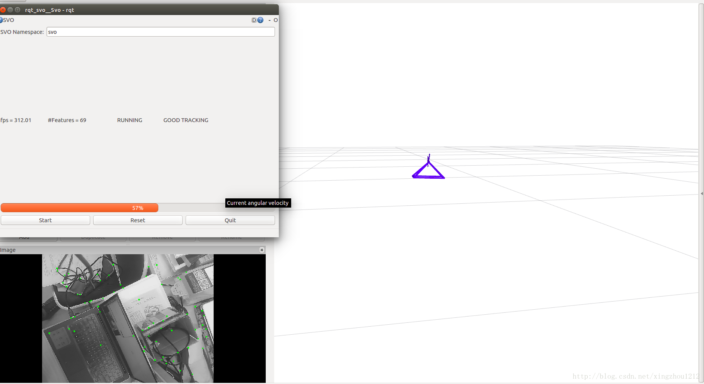
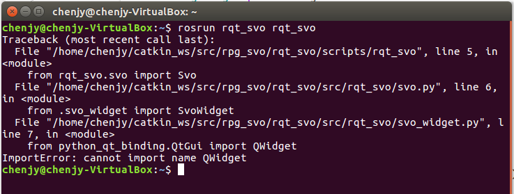

## SVO安装与测试
### 运行环境
* Ubuntu 16.04
* ROS-kinetic
### 安装部署
- Step1: 安装Sophus
~~~
cd catkin_ws/src/SVO 
git clone https://github.com/strasdat/Sophus.git 
cd Sophus 
git checkout a621ff 
mkdir build 
cd build 
cmake .. 
make
~~~
- Step2 : 安装Fast
~~~
cd catkin_ws/src/SVO
git clone https://github.com/uzh-rpg/fast.git
cd fast
mkdir build
cd build
cmake ..
make
~~~
- Step3 : 安装g2o 
~~~
cd catkin_ws/src/SVO
git clone https://github.com/RainerKuemmerle/g2o.git
cd g2o
mkdir build
cd build
cmake ..
make
sudo make install
~~~
- Step4 : 安装vikit
~~~
cd catkin_ws/src/SVO
git clone https://github.com/uzh-rpg/rpg_vikit.git
~~~
- Step5 : 安装ROS依赖项
~~~
sudo apt-get install ros-indigo-cmake-modules 
~~~
- Step6 : 安装SVO
~~~
cd catkin_ws/src/SVO
git clone https://github.com/uzh-rpg/rpg_svo.git
~~~
-Step7 : 编译SVO
~~~
 cd  ~/catkin_ws/ 
 catkin_make      
~~~
-Step8 : 测试SVO
- 启动SVO
~~~
roslaunch svo_ros test_rig3.launch
~~~
- 启动rviz
~~~
rosrun rviz rviz -d <PATH TO rpg_svo>/svo_ros/rviz_config.rviz #改成相应自己的路径
~~~
- 启动GUI界面
~~~
rosrun rqt_svo rqt_svo
~~~
在SVO Namespace 填入svo
 点击start按钮
- 跑测试数据集
下载[数据集](rpg.ifi.uzh.ch/datasets/airground_rig_s3_2013-03-18_21-38-48.bag)
~~~
rosbag play airground_rig_s3_2013-03-18_21-38-48.bag
~~~
操作截图如下：

### 问题记录
启动SVO GUI界面失败  

  
 
解决办法：   
将/rpg_svo/rqt_svo/src/rqt_svo/svo_widget.py文件`from python_qt_binding.QtGui import QWidget`改为`from python_qt_binding.QtWidgets import QWidget`
